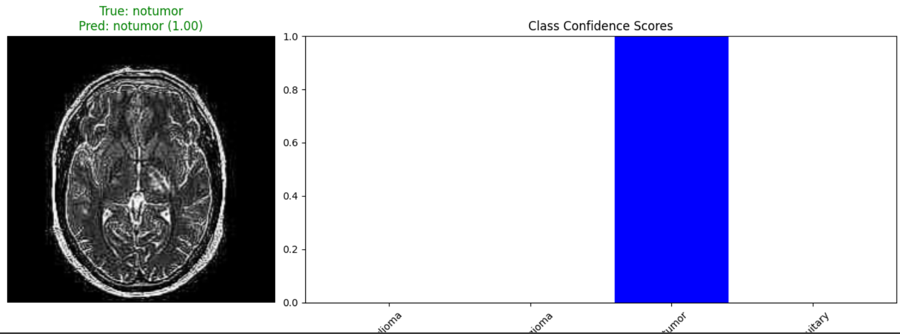

# Brain Tumor MRI Classification

This project implements deep learning models to classify brain MRI scans into different tumor categories. It uses PyTorch to build and train CNN models that can distinguish between different types of brain tumors from MRI images.



## 📋 Table of Contents

- [Overview](#overview)
- [Dataset](#dataset)
- [Models](#models)
- [Results](#results)

## 🔍 Overview

This project demonstrates how to:

- Process and prepare medical imaging data for deep learning
- Implement data augmentation techniques for medical images
- Build a custom CNN architecture for medical image classification
- Fine-tune a pre-trained ResNet-50 model for transfer learning
- Evaluate and compare model performance on the test set

## 📊 Dataset

The project uses the [Brain Tumor MRI Dataset](https://www.kaggle.com/datasets/masoudnickparvar/brain-tumor-mri-dataset) from Kaggle, which contains MRI scans categorized into four classes:

- Glioma
- Meningioma
- No tumor (healthy)
- Pituitary tumor

The dataset is automatically downloaded using `kagglehub` and split into training (70%), validation (15%), and test (15%) sets with stratification to maintain class balance.

## 🧠 Models

### Custom CNN Architecture

A custom 4-layer CNN with:

- Four convolutional blocks with increasing filter sizes (32→64→128→256)
- Each block includes batch normalization, ReLU activation, and max pooling
- Fully connected layers with dropout for regularization
- ~26 million trainable parameters

### Per-class Performance (Custom CNN)

- Glioma: 79.95%
- Meningioma: 81.78%
- No Tumor: 89.33%
- Pituitary: 97.73%

### ResNet-50 (Transfer Learning)

- Pre-trained ResNet-50 with frozen base layers
- Custom classifier head fine-tuned for tumor classification
- Only the fully connected layer is trained (8.1K trainable parameters)

## 📈 Results

| Model      | Test Accuracy | Training Time |
| ---------- | ------------- | ------------- |
| Custom CNN | 86.81%        | ~15 epochs    |
| ResNet-50  | 90.13%        | ~10 epochs    |

### Per-class Performance (ResNet-50)

- Glioma: 86.01%
- Meningioma: 79.76%
- No Tumor: 98.33%
- Pituitary: 94.32%

## 🛠️ Installation

```bash
# Clone the repository
git clone https://github.com/Zain4391/brain-tumor-classification.git
cd brain-tumor-classification
```

## 📜 License

This project is licensed under the MIT License - see the LICENSE file for details.

## 🙏 Acknowledgments

- Dataset provided by Masoud Nickparvar on Kaggle
- PyTorch and torchvision teams for the deep learning frameworks
